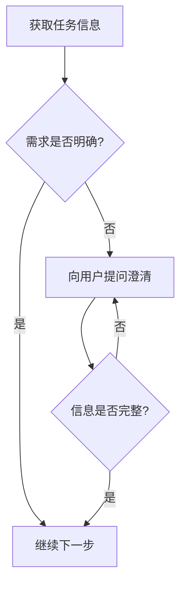
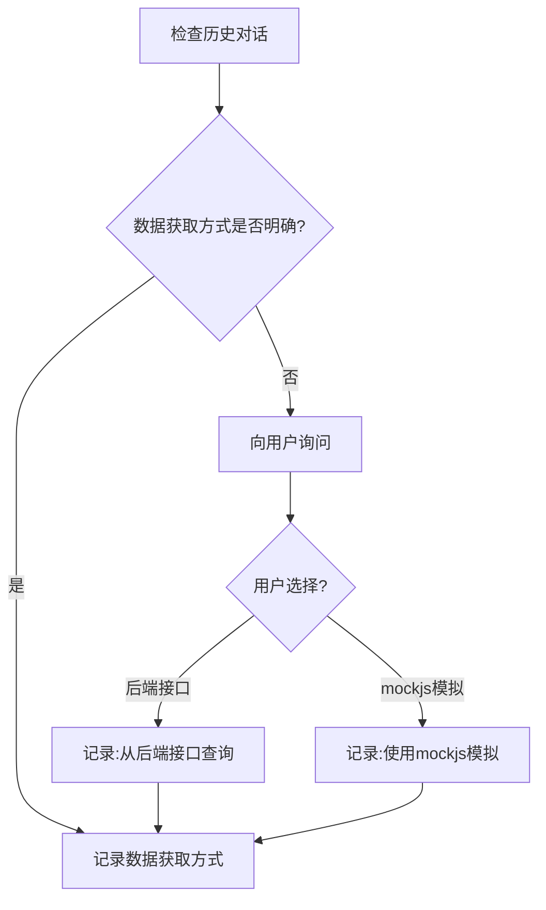
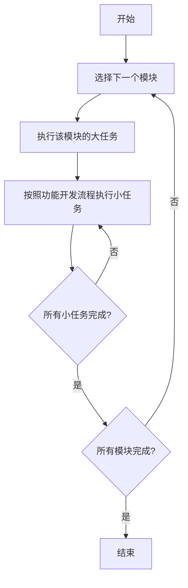

# 开发新功能模块的详细介绍

本文档提供系统化的新功能模块开发流程指导,确保从需求理解到最终交付的每个环节都能高效、规范地完成。

---

## 1. 任务介绍

### 1.1 任务目标

你的任务是基于当前的前端工程项目进行新功能模块开发。

### 1.2 工作范围

- 理解并分析功能需求
- 制定开发计划和任务分解
- 实施功能模块开发
- 进行质量检查和问题修复
- 完成相关文档编写

### 1.3 预期成果

- 功能模块开发完成并通过质量检查
- 代码符合项目规范要求
- UI还原度满足设计要求(有设计稿时)
- 相关文档完整且符合规范

---

## 2. 需求判断

**重要:** 本节所有步骤都**不可跳过**,必须逐一完成。

### 2.1 理解任务上下文

结合对话的上下文,检查对当前任务的理解是否完整。

**重要:** 在理解功能模块需求时,需要根据 `project-structure-spec.md` 和 `doc-reading-mechanism.md` 规范,查找并加载对应功能模块的需求文档。

#### 2.1.0 查找并加载需求文档

根据 `project-structure-spec.md` 和 `doc-reading-mechanism.md` 规范,按以下步骤查找并加载需求文档:

**步骤 1: 确定功能模块名称**

根据当前开发任务,确定所属的**功能模块名称**(驼峰式或短横线式英文,如 `user-management`、`order-system`)。

**步骤 2: 查找需求文档**

在 `docs/requirements/<功能模块>/` 目录下查找需求文档:
- 主要文档: `需求描述.md`
- 参考文档: `references/前端方案设计.md`、`references/后端方案设计.md`

**步骤 3: 加载需求文档(如果存在)**

- 如果需求文档存在,则加载并阅读:
  - 业务背景
  - 功能点清单
  - 用户故事
  - 验收标准
- 如果需求文档不存在,则不加载,继续后续步骤

**需求文档路径示例:**

```
docs/
  └─ requirements/
      └─ user-management/
          ├─ 需求描述.md          ← 主要加载此文档
          ├─ references/
          │   ├─ 前端方案设计.md   ← 可选加载
          │   └─ 后端方案设计.md   ← 可选加载
          └─ assets/
```

#### 2.1.1 关键问题清单

**必须回答的问题:**
- 哪些需求是明确的?
- 哪些地方可能存在歧义?
- 如果直接开始写代码最可能误解哪里?

#### 2.1.2 信息收集流程



#### 2.1.3 建议询问的内容

对不清楚的信息需要逐一让用户进行补充:

- 功能模块的核心功能是什么?
- 目标用户是谁?
- 主要的业务流程是什么?
- 是否有特殊的性能要求?
- 是否有特定的技术栈要求?
- 是否有相关的需求文档或原型?

### 2.2 判断是否需要蓝湖UI设计稿

结合历史对话判断是否需要按照蓝湖UI设计稿进行页面开发。

#### 2.2.1 判断依据

**关键词识别:**
- **有设计稿**: 对话中出现"设计稿"、"UI稿"、"蓝湖"、"lanhu"等关键词
- **无设计稿**: 对话中明确说明无需设计稿,或无相关提及

#### 2.2.2 判断流程

```
检查历史对话内容
  ↓
是否提及设计稿?
  ├─ 是 → 确认设计稿链接
  └─ 否 → 向用户询问
          ├─ 用户选择有设计稿 → 获取蓝湖链接
          └─ 用户选择无设计稿 → 记录决策
```

#### 2.2.3 向用户询问

如果不确定或者缺少UI设计稿链接信息,**必须**让用户补充:

**建议询问内容:**
- 当前功能模块是否需要根据UI设计稿进行开发?
- 如果需要,请提供蓝湖UI设计稿的链接地址

### 2.3 判断数据获取方式

结合历史对话判断页面的数据如何获取。

#### 2.3.1 数据获取方式选项

| 方式 | 适用场景 | 说明 |
|------|---------|------|
| **从后端接口查询数据** | 已有后端API | 使用 openapi mcp 工具查询真实接口数据 |
| **使用 mockjs 进行数据模拟** | 无后端API或前后端并行开发 | 设计数据模型并使用 mockjs 模拟 |

#### 2.3.2 判断流程



#### 2.3.3 向用户询问

如果不清楚数据获取方式,**必须**让用户补充:

**建议询问内容:**
- 页面数据如何获取?(选项: 1. 从后端接口查询数据; 2. 使用 mockjs 进行数据模拟)
- 如果是从后端接口查询,是否有可用的API文档或接口信息?
- 如果是使用 mockjs,是否有数据模型要求?

### 2.4 判断项目类型

结合对话信息和项目已有的信息,判断当前是大屏项目还是PC端普通网页项目。

#### 2.4.1 判断依据

**关键词识别:**

| 项目类型 | 关键词特征 |
|---------|-----------|
| **大屏项目** | 大屏、可视化大屏、数据可视化、指挥中心、展厅、数字孪生 |
| **PC端项目** | 管理后台、admin、业务系统、企业应用、响应式、计算运维管理 |

**项目特征分析:**

| 特征维度 | 大屏项目 | PC端项目 |
|---------|---------|---------|
| **尺寸特征** | 固定尺寸(如4352x1536) | 响应式布局 |
| **组件库特征** | 不使用 origami-vue | 使用 origami-vue(推荐) |
| **技术栈特征** | ECharts、@tslfe/dt-engine | 通用前端技术栈 |
| **布局特征** | 卡片、面板、装饰元素 | 管理后台布局模式 |

#### 2.4.2 判断流程

```
获取对话上下文和项目信息
  ↓
分析关键词和项目特征
  ↓
项目类型确定?
  ├─ 是 → 进入对应开发流程
  └─ 否 → 向用户询问项目类型
```

#### 2.4.3 向用户询问

如果不清楚项目类型,**必须**让用户补充:

**建议询问内容:**
- 当前项目属于哪种类型?(选项: 1. 大屏项目; 2. PC端普通网页项目)
- 项目的主要用途是什么?
- 项目的目标屏幕尺寸是什么?

#### 2.4.4 项目类型与 Skill 对照表

| 项目类型 | 必激活 Skill | 说明 |
|---------|-------------|------|
| **大屏项目** | `tsl-big-screen-best-practices` | 遵循大屏项目开发规范 |
| **PC端项目** | `tsl-admin-best-practices` + `origami-vue` | 遵循管理后台开发规范 |

---

## 3. 制定任务

### 3.1 识别功能模块清单

根据开发任务准确识别需要开发的功能模块清单。

#### 3.1.1 模块识别方法

**步骤 1: 分析需求范围**

- 列出所有需要开发的功能点
- 识别功能之间的依赖关系
- 确定开发的优先级

**步骤 2: 模块划分原则**

- 按业务功能划分:每个独立的业务功能作为一个模块
- 按页面划分:每个独立页面作为一个模块
- 按用户角色划分:不同用户角色的功能分别作为模块

**步骤 3: 形成模块清单**

输出格式:

```markdown
## 功能模块清单

1. **模块A名称**
   - 功能描述: ...
   - 主要功能点: ...
   - 依赖模块: ...

2. **模块B名称**
   - 功能描述: ...
   - 主要功能点: ...
   - 依赖模块: ...
```

### 3.2 任务分解方法

#### 3.2.1 大任务与小任务

- **大任务**: 每一个功能模块是一个大任务
- **小任务**: 大任务内部的各个步骤是小任务

#### 3.2.2 任务分解原则

1. **完整性**: 确保覆盖所有开发环节
2. **可执行性**: 每个小任务都有明确的输入输出
3. **依赖性**: 明确任务之间的依赖关系
4. **可验证性**: 每个任务都有验证标准

#### 3.2.3 任务分解示例

以"用户管理模块"为例:

```
大任务: 用户管理模块开发
  ├─ 小任务1: 基础准备(查看规范、下载切图等)
  ├─ 小任务2: 组件封装
  ├─ 小任务3: 页面布局
  ├─ 小任务4: 路由配置
  ├─ 小任务5: 数据模型设计
  ├─ 小任务6: 状态管理开发
  ├─ 小任务7: 数据请求开发
  ├─ 小任务8: 页面数据绑定
  ├─ 小任务9: 逻辑开发
  ├─ 小任务10: 逻辑检查
  └─ 小任务11: 质量检查
```

### 3.3 任务执行顺序

#### 3.3.1 执行原则

**重要:** 所有任务都不可跳过,需要严格逐一执行。

- 每一个大任务需要按照第4项功能开发流程执行
- 大任务之间根据依赖关系确定执行顺序
- 大任务内部的小任务按照功能开发流程顺序执行

#### 3.3.2 执行流程



---

## 4. 功能开发

### 4.1 基础准备

#### 4.1.1 掌握项目规范

根据 `frontend-engineering-standards` skill 与当前项目的实际情况,掌握需要遵循的规范和可复用的功能模块和代码。

**必激活 Skill:** `frontend-engineering-standards`

**重要:** 在进行功能模块开发时,需要根据 `project-structure-spec.md` 和 `doc-reading-mechanism.md` 规范,查找并加载对应功能模块的前端开发设计方案。

##### 查找并加载前端开发设计方案

根据 `project-structure-spec.md` 和 `doc-reading-mechanism.md` 规范,按以下步骤查找并加载前端开发设计方案:

**步骤 1: 确定功能模块名称**

根据当前开发任务,确定所属的**功能模块名称**(驼峰式或短横线式英文,如 `user-management`、`order-system`)。

**步骤 2: 查找前端开发设计方案**

在 `docs/implements/<功能模块>/` 目录下查找前端开发设计方案:
- 主要文档: `前端实施的方案.md`
- 概要文档: `方案概要描述.md`

**步骤 3: 加载前端开发设计方案(如果存在)**

- 如果前端开发设计方案存在,则加载并阅读:
  - 技术选型
  - 架构设计
  - 模块划分
  - 接口设计
  - 数据模型
  - 关键实现
  - 测试方案
- 如果前端开发设计方案不存在,则不加载,继续后续步骤

**前端开发设计方案路径示例:**

```
docs/
  └─ implements/
      └─ user-management/
          ├─ 方案概要描述.md      ← 先读:理解目标、范围、关键决策
          ├─ 前端实施的方案.md    ← 主要加载此文档
          └─ 后端实施的方案.md    ← 可选:了解后端接口设计
```

**关键检查项:**

- [ ] 目录结构规范
- [ ] 命名规范
- [ ] 代码风格规范
- [ ] 组件封装规范
- [ ] 样式组织规范
- [ ] 路由配置规范
- [ ] 状态管理规范
- [ ] 可复用组件清单

#### 4.1.2 蓝湖UI设计稿处理(有设计稿时)

**适用条件:** 已确认需要根据蓝湖UI设计稿开发页面

##### 使用 lanhu MCP 工具查看界面

**步骤 1: 获取设计稿列表**

使用 `lanhu_get_designs` 工具获取UI设计稿图片列表。

**步骤 2: 定位目标设计稿**

根据当前功能模块名称,在列表中找到对应的设计稿。

**步骤 3: 分析设计稿**

使用 `lanhu_get_ai_analyze_design_result` 工具获取详细的样式信息,包括:
- 布局结构
- 颜色值
- 字体样式
- 间距
- 边框和阴影

#### 4.1.3 切图资源下载(有设计稿时)

**适用条件:** 已确认需要根据蓝湖UI设计稿开发页面

##### 使用 lanhu MCP 工具下载切图

**步骤 1: 获取切图列表**

使用 `lanhu_get_design_slices` 工具获取切图资源列表。

**步骤 2: 下载切图到前端工程静态资源目录**

将切图下载到前端工程对应的静态资源目录中,例如 `assets/images/{模块名}/`。

**命名规范:**
- 图标: `icon-{功能名称}.png`
- 背景: `bg-{位置描述}.jpg`
- 按钮: `btn-{动作描述}.png`

#### 4.1.4 无设计稿场景处理

**适用条件:** 没有蓝湖UI设计稿

##### 界面呈现和交互方式确定

**原则:** 界面需要工整、色调统一、交互便利

**必须让用户补充的信息:**
- 界面的整体风格要求
- 主要的颜色方案
- 关键交互方式的说明

##### 大屏项目规范(无设计稿时)

**条件:** 当前项目是大屏项目

**必激活 Skill:** `tsl-big-screen-best-practices`

**遵守规范:**

| 规范项 | 要求 |
|--------|------|
| **尺寸适配** | 基准尺寸为1920x1080,使用缩放适配方案 |
| **图表规范** | ECharts图表配置符合大屏规范 |
| **样式系统** | 使用Less样式系统 |
| **布局结构** | 卡片、面板、装饰元素遵循大屏设计 |
| **动画效果** | 页面切换动画、数据更新动画流畅 |
| **组件库** | 不使用 origami-vue,使用专门的图表库 |
| **性能优化** | 图表渲染性能、数据更新频率合理 |

##### PC端项目规范(无设计稿时)

**条件:** 当前项目是PC端普通网页项目

**必激活 Skill:** `tsl-admin-best-practices` + `origami-vue`

**重要:** PC端项目开发时,**必须优先使用 origami-vue 组件库**进行开发。origami-vue 组件库的使用手册可以查看 **"origami-vue" skill**。

**遵守规范:**

| 规范项 | 要求 |
|--------|------|
| **组件库使用** | **优先使用** origami-vue 组件库(OriButton、OriTable、OriForm、OriModal、OriSelect等),查阅 "origami-vue" skill 获取详细使用指南 |
| **基础字号** | 基础字号为14px |
| **主色调** | 紫蓝主色调,颜色使用符合设计规范 |
| **布局模式** | 管理后台布局模式,导航、侧边栏、内容区合理 |
| **表格规范** | **优先使用 OriTable 组件**,列配置、分页、筛选正确,查阅 "origami-vue" skill 了解 API |
| **表单规范** | **优先使用 OriForm 组件**,验证、提交、重置正确,查阅 "origami-vue" skill 了解 API |
| **详情页规范** | 详情页布局、信息展示规范,使用 origami-vue 的详情展示组件 |

### 4.2 功能开发

#### 4.2.1 UI分析(有设计稿时)

**适用条件:** 有蓝湖UI设计稿

##### 使用 lanhu MCP 工具分析界面排版

**目的:** 明确当前功能模块的整体布局、色调、字体等

**步骤 1: 获取设计稿信息**

使用 `lanhu_get_ai_analyze_design_result` 工具获取:
- 整体布局结构
- 颜色方案
- 字体规范
- 间距标准

**步骤 2: 分析设计稿要点**

**布局分析:**
- 页面的整体结构(头部、内容区、底部等)
- 内容区的布局方式(grid、flex等)
- 响应式设计要点

**色调分析:**
- 主色调
- 辅助色
- 文字颜色
- 背景颜色
- 边框颜色

**字体分析:**
- 字体族
- 字号层级
- 字重使用
- 行高标准

**间距分析:**
- 内边距(padding)
- 外边距(margin)
- 元素间距
- 边距一致性

#### 4.2.2 组件封装

##### 原则

**优先封装可复用组件:**
- 提取当前功能模块可复用的组件
- 尽量复用已经存在的组件和样式,减少雷同

**PC端项目特殊原则:**

**重要:** 如果当前是 PC 端普通网页项目,**必须优先使用 origami-vue 组件库**进行开发,而不是自己封装基础组件。

- 在封装组件前,**先检查 origami-vue 组件库是否已提供该功能**
- **优先使用** origami-vue 的组件(OriButton、OriInput、OriTable、OriForm、OriModal、OriSelect、OriTree等)
- 只在 origami-vue 组件库无法满足需求时,才考虑封装业务组件
- 封装组件时,可以基于 origami-vue 的基础组件进行二次封装
- 查阅 **"origami-vue" skill** 获取组件库的详细使用手册和 API 文档

##### 封装步骤

**步骤 1: 识别可封装组件**

- 重复出现的UI元素
- 独立的功能单元
- 可配置的通用组件

**步骤 2: 检查现有组件库(重要)**

**PC端项目必须先检查:**
- 检查 origami-vue 组件库是否已提供所需功能
- 查看 "origami-vue" skill 了解组件 API 和使用方法
- 优先使用 origami-vue 的现成组件

**通用检查:**
- 检查项目中是否已有类似组件,优先复用

**步骤 3: 设计组件接口**

设计合理的 props、events、slots。

**步骤 4: 实现组件**

遵循项目的组件开发规范。

##### 组件命名规范

| 组件类型 | 命名示例 | 说明 |
|---------|---------|------|
| **业务组件** | `UserCard.vue` | 大驼峰命名 |
| **基础组件** | `BaseButton.vue` | Base前缀 |
| **公共组件** | `CommonModal.vue` | Common前缀 |

##### PC端项目常用 origami-vue 组件

| 组件 | 用途 | 查阅文档 |
|------|------|---------|
| `OriButton` | 按钮组件 | "origami-vue" skill |
| `OriInput` | 输入框组件 | "origami-vue" skill |
| `OriTable` | 表格组件 | "origami-vue" skill |
| `OriForm` | 表单组件 | "origami-vue" skill |
| `OriModal` | 模态框组件 | "origami-vue" skill |
| `OriSelect` | 下拉选择组件 | "origami-vue" skill |
| `OriTree` | 树形组件 | "origami-vue" skill |
| `OriDatePicker` | 日期选择器 | "origami-vue" skill |

#### 4.2.3 页面布局

##### 布局原则

**先从整体再到局部:**
- 先确定页面的整体结构
- 再逐层细化局部布局
- 最后进行对齐、边框、颜色和字体等细节

**PC端项目布局原则:**

**重要:** 如果当前是 PC 端普通网页项目,**必须优先使用 origami-vue 组件库**进行页面布局和功能开发。

- **优先使用** origami-vue 的布局组件和功能组件构建页面
- 使用 `OriTable` 实现表格页面布局
- 使用 `OriForm` 实现表单页面布局
- 使用 `OriModal` 实现弹窗和对话框
- 使用 `OriButton`、`OriInput`、`OriSelect` 等基础组件构建交互元素
- 查阅 **"origami-vue" skill** 获取组件库的详细使用手册

##### 布局流程

```
整体结构设计
  ↓
主要区域划分
  ↓
局部布局实现(PC端项目优先使用 origami-vue 组件)
  ↓
细节样式调整
  ↓
响应式适配(如需要)
```

##### 复杂页面处理

**对于特别复杂的页面:**
- 按照功能区域进行独立组件的分离
- 防止所有代码在一个文件的情况
- 保持每个组件职责单一

**PC端项目复杂页面处理:**
- **优先组合使用** origami-vue 的多个组件实现复杂功能
- 例如:使用 OriTable + OriModal + OriForm 组合实现表格增删改查
- 使用 OriTree + OriCard 组合实现树形卡片布局
- 查阅 "origami-vue" skill 了解组件组合使用的最佳实践

**拆分原则:**
- 每个组件不超过300行代码
- 每个组件只负责一个功能区域
- 组件之间通过 props 和 events 通信

#### 4.2.4 路由配置

##### 配置步骤

**步骤 1: 确定路由路径**

根据功能模块和页面结构确定路由路径。

**步骤 2: 配置路由**

在路由配置文件中添加路由定义:

```typescript
// router/index.ts
{
  path: '/module-path',
  name: 'ModuleName',
  component: () => import('@/views/module-path/index.vue'),
  meta: {
    title: '模块名称',
    // 其他meta信息
  }
}
```

**步骤 3: 权限拦截**

配置路由守卫和权限控制:

```typescript
// router/guards.ts
router.beforeEach((to, from, next) => {
  // 权限验证逻辑
  next()
})
```

##### 路由规范

- 路由路径使用小写和连字符: `/user-management`
- 路由名称使用大驼峰: `UserManagement`
- 动态路由使用冒号: `/user/:id`

#### 4.2.5 数据模拟或接口对接

##### 使用 mockjs 进行数据模拟(如适用)

**条件:** 需要使用 mockjs 进行数据模拟

**步骤 1: 设计数据模型**

根据功能需求设计数据模型:

```typescript
// types/index.ts
interface User {
  id: number
  name: string
  email: string
  role: string
  createdAt: string
}
```

**步骤 2: 创建 mock 数据**

使用 mockjs 模拟数据:

```javascript
// mock/user.js
import Mock from 'mockjs'

const users = Mock.mock({
  'list|20': [{
    'id|+1': 1,
    'name': '@cname',
    'email': '@email',
    'role': '@pick(["admin", "user", "guest"])',
    'createdAt': '@datetime'
  }]
}).list

export default {
  'GET /api/users': users
}
```

##### 从服务端获取真实数据(如适用)

**条件:** 从后端接口查询数据

**步骤 1: 使用 openapi mcp 工具查询接口**

使用 openapi mcp 工具从后端查询数据。

**步骤 2: 分析接口数据结构**

根据真实数据结构补充数据模型:

```typescript
// types/api.ts
interface ApiResponse<T> {
  code: number
  message: string
  data: T
}
```

**步骤 3: 创建 API 请求函数**

```typescript
// api/user.ts
import request from '@/utils/request'

export function getUsers(params: any) {
  return request.get('/api/users', { params })
}
```

**不清楚时让用户补充:**
- API 接口地址
- 请求方法(GET/POST等)
- 请求参数格式
- 响应数据格式

#### 4.2.6 状态管理开发

##### 选择状态管理方案

- **简单状态**: 使用 Vue 3 的 reactive/ref
- **复杂状态**: 使用 Pinia

##### Pinia Store 结构

```typescript
// stores/user.ts
import { defineStore } from 'pinia'

export const useUserStore = defineStore('user', {
  state: () => ({
    users: [] as User[],
    currentUser: null as User | null
  }),

  getters: {
    userCount: (state) => state.users.length
  },

  actions: {
    async fetchUsers() {
      const res = await getUsers({})
      this.users = res.data
    }
  }
})
```

#### 4.2.7 数据绑定

##### 数据绑定检查清单

- [ ] 模板中的数据绑定语法正确
- [ ] 条件渲染符合预期
- [ ] 列表渲染使用正确的 key
- [ ] 表单绑定使用 v-model
- [ ] 事件绑定使用 @ 符号

##### 常见数据绑定方式

| 场景 | 使用方式 |
|------|---------|
| 文本显示 | `{{ data }}` |
| 属性绑定 | `:src="url"` |
| 条件渲染 | `v-if="condition"` |
| 列表渲染 | `v-for="item in list" :key="item.id"` |
| 表单绑定 | `v-model="formData"` |
| 事件绑定 | `@click="handler"` |

#### 4.2.8 逻辑开发

##### 开发内容

根据实际情况完成其它所需逻辑开发和代码编写:

- 表单验证逻辑
- 数据转换逻辑
- 业务规则判断
- 异常处理逻辑
- 权限控制逻辑

##### 代码规范

- 遵循项目的代码风格规范
- 添加必要的注释
- 处理边界情况
- 进行错误处理

#### 4.2.9 逻辑检查

##### MVVM 逻辑检查

**Model 层检查:**
- [ ] 数据模型定义完整
- [ ] 数据类型正确
- [ ] 默认值合理

**ViewModel 层检查:**
- [ ] 状态管理合理
- [ ] 数据流清晰
- [ ] 响应式更新正确

**View 层检查:**
- [ ] 数据绑定正确
- [ ] 事件处理完整
- [ ] 条件渲染符合预期

##### 数据流逻辑检查

**数据流方向:**

```
用户操作
  ↓
事件触发
  ↓
Action 处理
  ↓
State 更新
  ↓
视图更新
```

**检查要点:**
- [ ] 数据从哪里来是否清晰
- [ ] 数据如何处理是否明确
- [ ] 数据到哪里去是否正确
- [ ] 数据更新是否触发视图更新
- [ ] 异步数据流是否正确处理

### 4.3 质量检查

#### 4.3.1 代码层面检查

从代码层面对当前开发的功能模块进行检测,确保逻辑正确且满足了需求。

##### 检查维度

**网络层检查:**
- [ ] API 请求是否正确发送
- [ ] 请求参数是否符合接口规范
- [ ] 响应数据是否正确解析
- [ ] 错误处理是否完善

**Store 检查:**
- [ ] 状态管理是否合理
- [ ] 数据流转是否正确
- [ ] 响应式更新是否生效
- [ ] 状态持久化是否正常

**逻辑层检查:**
- [ ] 业务逻辑是否正确
- [ ] 条件判断是否准确
- [ ] 循环和递归是否正确
- [ ] 边界条件是否处理

**View 层检查:**
- [ ] 数据绑定是否正确
- [ ] 条件渲染是否符合预期
- [ ] 列表渲染是否正常
- [ ] 事件处理是否绑定

**组件检查:**
- [ ] 组件通信是否正常
- [ ] Props 传递是否正确
- [ ] 事件触发是否符合预期
- [ ] 生命周期钩子是否正常

**样式检查:**
- [ ] 布局是否符合设计
- [ ] 响应式是否正常
- [ ] 交互效果是否符合预期
- [ ] 样式是否有冲突

#### 4.3.2 BUG 修复

参照 references 目录下的 **"bug-fix.md"** 手册,对当前开发的功能模块进行质量检查,修复存在的 BUG。

##### BUG 修复流程

按照"bug-fix.md"修复指南修复发现的问题:

1. 识别功能模块中的问题点
2. 分析问题的根本原因
3. 实施修复方案
4. 验证修复效果
5. 确保修复不会引入新的问题

#### 4.3.3 UI 还原度检查(有设计稿时)

**适用条件:** 有蓝湖UI设计稿

参照 references 目录下的 **"ui-review-and-restoration.md"** 手册,对当前开发的功能模块 UI 还原度进行走查,修复存在 UI 还原度问题。

##### 检查流程

按照"ui-review-and-restoration.md"指南进行:

1. 启动开发调试服务
2. 使用 Chrome DevTools MCP 工具访问页面
3. 使用 lanhu MCP 获取设计稿信息
4. 逐一对比检测
5. 样式修改后重新检测

#### 4.3.4 UI 规范检查(无设计稿时)

**适用条件:** 没有蓝湖UI设计稿

参照 references 目录下的 **"ui-quality-check-without-design.md"** 手册,对当前开发的功能模块 UI 规范进行走查,修复存在的问题。

##### 检查流程

按照"ui-quality-check-without-design.md"指南进行:

1. 判断项目类型(大屏项目或PC端项目)
2. 使用 bug-fix.md 指南进行 BUG 修复
3. 根据项目类型检查是否遵守对应规范
4. 迭代验证修改
5. 完成验收

---

## 5. 总结

### 5.1 需求文档更新

根据 `project-structure-spec.md` 规范,检查 `docs/requirements` 目录下当前功能模块目录,及功能模块目录下的 "需求描述.md" 文档。

#### 5.1.1 检查目录结构

确认目录结构是否符合规范:

```
docs/
  └─ requirements/
      └─ {模块名}/
          └─ 需求描述.md
```

#### 5.1.2 更新需求文档

根据当前的对话内容完成该文档创建或更正:

**文档内容结构:**

参照 `document-structure-standards` skill 规范:

1. 功能概述
2. 业务流程
3. 功能清单
4. 界面原型(如有)
5. 非功能需求

### 5.2 实施文档编写

根据 `project-structure-spec.md` 规范,在 `docs/implements` 目录下完成当前功能模块的 "前端实施方案.md" 文档的编写。

#### 5.2.1 检查文档是否存在

如果该文档已经存在,则检查并更正里面的内容。

#### 5.2.2 文档内容结构

文档的内容结构需要参照 `document-structure-standards` skill 规范:

1. 技术选型
2. 架构设计
3. 模块划分
4. 接口设计
5. 数据模型
6. 关键实现
7. 测试方案

---

## 6. 常见问题处理

### 6.1 需求判断不清楚

**问题描述:** 无法确定某些关键信息,如是否有设计稿、数据获取方式等。

**解决方案:**
1. 仔细回顾历史对话内容
2. 检查项目已有文档和代码
3. 直接向用户询问,获取明确答复
4. 记录决策过程,避免后续重复询问

### 6.2 功能模块划分困难

**问题描述:** 无法准确识别功能模块清单,模块之间边界不清晰。

**解决方案:**
1. 从用户视角梳理业务流程
2. 参考需求文档的功能清单
3. 与用户讨论确认模块划分
4. 优先处理核心模块,逐步细化

### 6.3 设计稿与实际需求不符

**问题描述:** 蓝湖UI设计稿与实际需求描述不一致。

**解决方案:**
1. 记录设计稿与需求文档的差异点
2. 向用户确认最终实现方案
3. 优先遵循需求文档的功能描述
4. UI 样式尽量还原设计稿

### 6.4 组件复用困难

**问题描述:** 发现难以复用现有组件,需要大量重复代码。

**解决方案:**
1. 重新审视组件设计,提取公共部分
2. 参考项目的组件库使用规范
3. 考虑使用高阶组件或组合式函数
4. 必要时重构现有组件结构

### 6.5 数据流逻辑混乱

**问题描述:** MVVM 架构下数据流不清晰,状态管理混乱。

**解决方案:**
1. 画出数据流图,明确数据来源和去向
2. 使用 Pinia 统一管理共享状态
3. 组件内部状态尽量简化
4. 避免直接修改 props,使用事件通信

### 6.6 质量检查不通过

**问题描述:** 功能模块开发完成,但质量检查发现多处问题。

**解决方案:**
1. 按照检查清单逐项排查
2. 优先修复阻塞性问题
3. 使用 Chrome DevTools MCP 工具验证
4. 每次修复后重新检查

### 6.7 文档编写困难

**问题描述:** 不清楚如何编写需求文档和实施文档。

**解决方案:**
1. 激活 `document-structure-standards` skill
2. 参考已有文档的格式和内容
3. 逐步补充文档内容,不必一次完成
4. 确保文档反映实际开发内容

### 6.8 PC端项目 origami-vue 组件使用问题

**问题描述:** 在PC端项目中使用 origami-vue 组件库时遇到问题,如组件API不熟悉、组件组合使用困难等。

**解决方案:**
1. **激活 origami-vue skill**: 查阅组件库的详细使用手册和 API 文档
2. **阅读组件API**: 仔细阅读 "origami-vue" skill 中提供的组件 API 说明
3. **查看使用示例**: 参考 skill 中的使用示例和最佳实践
4. **检查props和events**: 确认组件的 props、events、slots 使用是否正确
5. **优先使用组件库**: 不要重复造轮子,优先使用 origami-vue 提供的功能
6. **组合使用**: 对于复杂场景,学习如何组合使用多个组件
7. **常见问题**: 查看 "origami-vue" skill 中的常见问题和解决方案

**重要提示:**
- PC端项目开发时,必须优先使用 origami-vue 组件库
- 遇到组件使用问题时,第一时间查阅 "origami-vue" skill
- 不要自己封装已由 origami-vue 提供的基础组件

---

## 7. 最佳实践

### 7.1 开发原则

1. **需求明确再开发**: 确保理解所有需求细节
2. **先规划后编码**: 制定清晰的开发计划
3. **从小到大**: 先完成基础功能,再逐步完善
4. **持续验证**: 每个步骤都要验证是否正确
5. **文档同步**: 开发过程中同步更新文档

### 7.2 沟通原则

1. **主动询问**: 不清楚的地方主动向用户确认
2. **一次性收集**: 尽量一次性收集所有必要信息
3. **明确记录**: 记录所有决策和约定
4. **及时反馈**: 发现问题及时反馈

### 7.3 质量原则

1. **代码质量**: 遵循项目规范,代码可读可维护
2. **功能质量**: 功能完整,逻辑正确,无 BUG
3. **UI 质量**: 还原设计稿,或遵守项目 UI 规范
4. **文档质量**: 文档完整,内容准确,结构规范
5. **组件库使用(PC端)**: PC端项目必须优先使用 origami-vue 组件库,查阅 "origami-vue" skill 确保正确使用

---

## 8. 附录

### 8.1 相关 Skill 列表

| Skill 名称 | 用途 | 激活时机 |
|-----------|------|---------|
| `frontend-engineering-standards` | 前端工程规范 | 基础准备阶段 |
| `tsl-big-screen-best-practices` | 大屏项目规范 | 无设计稿且为大屏项目 |
| `tsl-admin-best-practices` | PC 端项目规范 | 无设计稿且为 PC 端项目 |
| `origami-vue` | origami-vue 组件库 | PC 端项目使用组件库时 |
| `document-structure-standards` | 文档结构规范 | 文档编写阶段 |

### 8.2 相关参考文档

| 文档名称 | 用途 |
|---------|------|
| [bug-fix.md](bug-fix.md) | BUG 修复流程指导 |
| [ui-review-and-restoration.md](ui-review-and-restoration.md) | UI 还原度走查指导 |
| [ui-quality-check-without-design.md](ui-quality-check-without-design.md) | 无设计稿的 UI 规范检查 |

### 8.3 MCP 工具清单

| MCP 工具 | 用途 |
|---------|------|
| `lanhu_get_designs` | 获取 UI 设计稿图片列表 |
| `lanhu_get_ai_analyze_design_result` | AI 分析设计稿结果 |
| `lanhu_get_design_slices` | 获取切图资源 |
| Chrome DevTools MCP | 页面调试和验证 |

---
