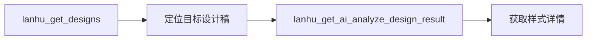
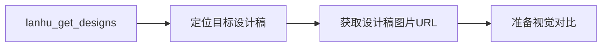

# 根据蓝湖UI稿走查进行1:1还原

本文档详细介绍如何按照蓝湖UI设计稿进行前端页面的1:1高度还原，包括需求判断、BUG修复和UI走查还原的完整流程。

## 1. 任务介绍

### 1.1 任务目标

你的任务是对当前的功能页面进行走查，需要按照提供的蓝湖UI设计稿进行1:1高度还原。

### 1.2 适用场景

- 前端功能模块开发完成后，需要进行UI还原度检查
- 已有功能页面需要与设计稿进行对比走查
- 页面样式调整后需要验证还原效果

## 2. 需求判断

### 2.1 获取蓝湖UI设计稿链接

结合已发生的对话内容和用户补充的信息，推断蓝湖UI设计稿的链接地址。

**重要：** 如果不确定或者缺少UI设计稿链接信息，**必须**让用户补充。此步骤不可跳过。

### 2.2 使用 lanhu MCP 工具获取设计稿

使用以下 lanhu MCP 工具获取设计稿信息：

| 工具名称 | 用途 |
|---------|------|
| `lanhu_get_designs` | 获取UI设计稿图片列表（首选调用） |
| `lanhu_get_ai_analyze_design_result` | AI分析设计稿结果，获取样式信息 |
| `lanhu_get_pages` | 获取PRD/原型页面（不用于UI设计图） |
| `lanhu_get_design_slices` | 获取切图资源（不用于UI设计图） |

**操作步骤：**

1. 然后调用 `lanhu_get_designs` 获取设计稿列表
2. 根据当前功能模块定位对应的设计稿
3. 调用lanhu mcp 工具`lanhu_get_ai_analyze_design_result` 获取详细的样式信息

## 3. BUG修复

### 3.1 使用 bug-fix.md 指南

使用 references 目录下的 "bug-fix.md" 指南，检查当前的功能模块是否存在功能缺陷。

### 3.2 BUG修复流程

按照"bug-fix.md"修复指南修复发现的问题

## 4. UI走查和还原

### 4.1 启动开发调试服务

在进行UI还原度走查前，需要先在本地启动开发调试服务：

```bash
# 根据项目配置选择启动命令
npm run dev
# 或
npm run serve
```

等待服务启动完成，记录本地访问地址（如 `http://localhost:3000`）。

### 4.2 使用 Chrome DevTools MCP 工具访问页面

使用 Chrome DevTools MCP 工具访问当前功能模块的路径，进行以下检查：

#### 4.2.1 检查控制台错误

使用 Chrome DevTools MCP 工具 `list_console_messages` 工具检测控制台是否有错误：

```javascript
// 过滤错误和警告类型
types: ["error", "warn"]
```

#### 4.2.2 验证功能模块正常性

使用以下工具验证功能：

| 工具 | 用途 |
|------|------|
| `take_snapshot` | 获取页面元素快照，验证页面结构(注意：截图前需要等页面完全加载完，且如果是大屏项目时必须根据页面的实际尺寸对页面进行缩放) |
| `click` | 点击按钮验证交互 |
| `hover` | 悬停验证样式变化 |
| `type_text` | 输入文本验证表单功能 |

#### 4.2.3 检查页面数据渲染

通过 Chrome DevTools MCP 工具 `take_snapshot` 获取页面内容，确认数据是否正常渲染。(注意：截图前需要等页面完全加载完，且如果是大屏项目时必须根据页面的实际尺寸对页面进行缩放)

### 4.3 使用 lanhu MCP 获取设计稿信息

同时使用 lanhu MCP 工具获取当前功能模块对应的UI稿信息：



### 4.4 视觉对比走查（必须执行）

**重要：** 此步骤为UI还原度检查的核心环节，**必须执行**，不可跳过。

#### 4.4.1 获取实际页面截图

使用 Chrome DevTools MCP 工具获取当前功能模块的完整页面截图：

**步骤：**

1. 确保开发服务器已启动且页面可访问
2. 使用 `take_screenshot` 工具获取整个页面的截图
3. 保存截图用于后续对比分析

```javascript
// Chrome DevTools MCP - take_screenshot
// 获取完整页面截图
{
  fullPage: true,  // 捕获整个页面（包括滚动区域）
  quality: 100     // 最高质量
}
```

#### 4.4.2 获取设计稿图片

使用 lanhu MCP 工具获取对应的UI设计稿图片：

**步骤：**

1. 调用 `lanhu_get_designs` 获取设计稿列表
2. 根据当前功能模块定位目标设计稿
3. 获取设计稿图片用于视觉对比



#### 4.4.3 视觉对比分析

将实际页面截图与设计稿图片进行直观对比：

**对比维度：**

| 对比维度 | 检查要点 | 对比方式 |
|---------|---------|---------|
| 整体布局 | 页面结构、元素位置 | 视觉叠加对比 |
| 视觉效果 | 颜色、阴影、圆角 | 截图并排对比 |
| 尺寸比例 | 元素大小、间距 | 测量对比 |
| 切图还原 | 图标、图片资源 | 像素级对比 |

**对比方法：**

```
1. 【实际页面】Chrome DevTools MCP → take_screenshot → 获取完整截图
   ↓
2. 【设计稿】lanhu MCP → lanhu_get_designs → 获取设计稿图片
   ↓
3. 【视觉对比】将两张图片并排展示或叠加对比
   ↓
4. 【问题记录】标记发现的还原度问题
   ↓
5. 【逐一修复】根据对比结果调整样式代码
   ↓
6. 【重新验证】修改后重新截图对比
   ↓
7. 【循环迭代】直到视觉还原度达到要求
```

#### 4.4.4 问题定位与修复

根据视觉对比发现的问题，进行定位和修复：

1. **布局问题** → 检查 CSS 布局代码（Flex、Grid、Position等）
2. **尺寸问题** → 检查 width、height、padding、margin 等样式
3. **颜色问题** → 检查 color、background-color、border-color 等
4. **字体问题** → 检查 font-size、font-weight、line-height 等
5. **切图问题** → 使用 `lanhu_get_design_slices` 重新下载切图资源

### 4.5 代码级对比检测

在完成视觉对比后，进行更精细的代码级对比检测，确保每个细节都达到1:1还原。

#### 4.5.1 对比检查项

| 检查项 | 说明 |
|--------|------|
| 布局结构 | 元素排列顺序、层级关系 |
| 尺寸大小 | 宽度、高度、内边距、外边距 |
| 切图资源 | 图片路径、格式 |
| 颜色值 | 文字颜色、背景色、边框色 |
| 字体样式 | 字体大小、字重、行高、字体族 |
| 间距 | 元素之间的间距、边距 |
| 边框 | 边框宽度、样式、圆角 |
| 阴影 | box-shadow 参数 |
| 交互状态 | hover、active、disabled 等状态样式 |

#### 4.5.2 代码级对比流程

```
1. 获取设计稿样式信息（lanhu MCP）
   ↓
2. 获取实际页面布局信息（Chrome DevTools MCP）
   ↓
3. 如果有切图资源缺失，使用lanhu MCP工具`lanhu_get_design_slices`获取切图资源（lanhu MCP）
   ↓
4. 逐项对比差异
   ↓
5. 修改样式代码
   ↓
6. 重新检测验证
   ↓
7. 循环直到完全还原
```

### 4.6 样式修改后重新检测

每一次进行了界面样式修改都需要按照上述方式进行逐一检测，直到已经按照蓝湖UI稿进行了1:1高度还原为止。

**重要：** 不要跳过检测环节，确保每处修改都经过验证。

### 4.7 完成后关闭开发服务

所有检查项都完成且满足要求后，关闭本地的开发调试服务：

```bash
# 停止开发服务器（Ctrl+C 或关闭终端）
```

## 5. 验收标准

### 5.1 功能验收

- [ ] 控制台无错误日志
- [ ] 功能模块交互正常
- [ ] 页面数据正常渲染

### 5.2 UI还原验收

#### 5.2.1 视觉对比验收（必须）

- [ ] 已使用 Chrome DevTools MCP 获取完整页面截图
- [ ] 已使用 lanhu MCP 获取对应设计稿图片
- [ ] 已完成实际页面截图与设计稿图片的视觉对比
- [ ] 视觉对比中发现的还原度问题已全部修复

#### 5.2.2 代码级验收

- [ ] 布局结构与设计稿一致
- [ ] 颜色值与设计稿一致
- [ ] 字体样式与设计稿一致
- [ ] 间距与设计稿一致
- [ ] 边框和阴影效果与设计稿一致
- [ ] 交互状态样式与设计稿一致

## 6. 常见问题处理

### 6.1 设计稿链接无法访问

- 确认链接格式正确
- 检查是否有访问权限
- 联系设计团队获取有效链接

### 6.2 样式无法完全还原

- 与设计师沟通确认设计意图
- 检查是否为浏览器兼容性问题
- 考虑响应式设计的影响

### 6.3 MCP 工具调用失败

- 检查 MCP 服务是否正常运行
- 确认工具参数格式正确
- 查看 MCP 服务日志排查问题

### 6.4 视觉对比发现问题

- 使用 Chrome DevTools 的元素审查功能定位具体问题
- 结合 lanhu MCP 的 `lanhu_get_ai_analyze_design_result` 获取精确样式值
- 先修复明显的布局和尺寸问题，再处理细节样式
- 每次修复后重新截图对比验证

### 6.5 截图与设计稿差异明显

- 检查页面是否在正确的视口尺寸下截图（参考设计稿的设备尺寸）
- 确认页面数据是否正常加载（空数据状态可能影响布局）
- 检查是否有动态内容或动画影响截图效果
- 考虑在不同分辨率下进行多次对比测试